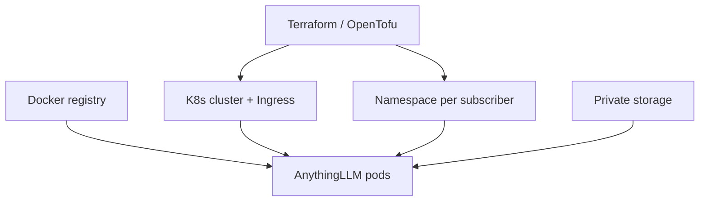
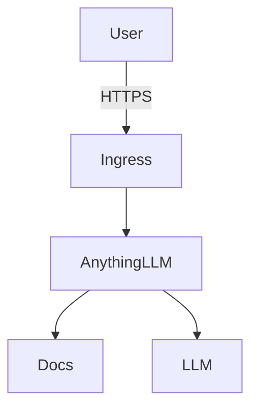
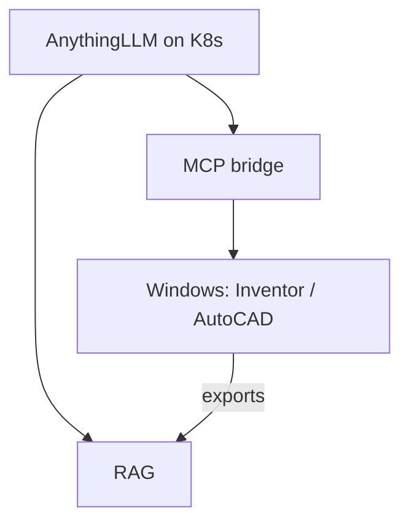

# Plan — Autodesk MCP + RAG cloud

## Stack

| Layer | Tool | Does |
|-------|------|------|
| Images | **Docker** | Build / ship OCI images |
| Orchestration | **Kubernetes** | Pods, health, restarts, scale |
| Infra | **OpenTofu / Terraform** | Cluster, storage, DNS, tenant clone |
| AI / RAG | **AnythingLLM** | Private / public subscriber AI |
| Inventor (v2) | **ipt-mcp** | Drive Inventor |
| AutoCAD (v2) | **U-C4N** | Drive AutoCAD |

```text
Terraform/OpenTofu → Kubernetes → Pods (AnythingLLM)
                         ↑
                  Docker images (registry)
```

Local laptop only: Docker Compose OK.  
Cloud: **K8s** (not Compose).

---

## Scope — v1

**In**
- AnythingLLM (private / public workspaces)
- Terraform/OpenTofu → K8s cluster + storage + Ingress
- Docker images (official AnythingLLM + any custom)
- K8s deploy per subscriber (Namespace / Helm)
- PDF + text ingest
- LLM: cloud API and/or Ollama
- Clone path: `subscriber_id`

**Out**
- CAD MCP in v1
- Raw `.ipt` / `.dwg` as RAG (no export)
- Multi-region active-active
- Billing / signup automation

---

## Scope — v2

- Windows CAD workers: **ipt-mcp** + **U-C4N**
- `.ipt` / `.dwg` → PDF / DXF / props → RAG
- ChatGPT remote MCP gateway
- Billing / signup

---

## Flows

### Provision (clone)



### Use



### CAD later (v2)



---

## Tenant isolation

| What | How |
|------|-----|
| Compute | K8s Namespace (+ NetworkPolicy) |
| Data | Own PVC / bucket |
| AI | Own AnythingLLM; private by default |
| Public AI | Shared workspace or public route |
| CAD (v2) | Windows pool; tenant auth |

---

## Build order

| # | Do |
|---|----|
| 1 | **Done (scaffold):** modular folders + `test-ui` |
| 2 | Local AnythingLLM (swap for `rag/local`) |
| 3 | Terraform → K8s cluster |
| 4 | K8s manifests / Helm + probes + PVC + Ingress |
| 5 | Clone via `subscriber_id` |
| 6 | v2: Windows CAD + MCP + export→RAG |

## Repo modules

| Folder | Replaceable piece |
|--------|-------------------|
| `rag/` | Knowledge backend |
| `docker/` | Images / local Compose |
| `k8s/` | Orchestration manifests |
| `terraform/` | Infra modules |
| `mcp/` | Inventor / AutoCAD |
| `test-ui/` | Dev chat harness |

---

## Licenses (OSS)

| Piece | License |
|-------|---------|
| AnythingLLM | MIT |
| Kubernetes | Apache-2.0 |
| OpenTofu | MPL-2.0 |
| ipt-mcp | Apache-2.0 |
| U-C4N Autocad-MCP | MIT |
