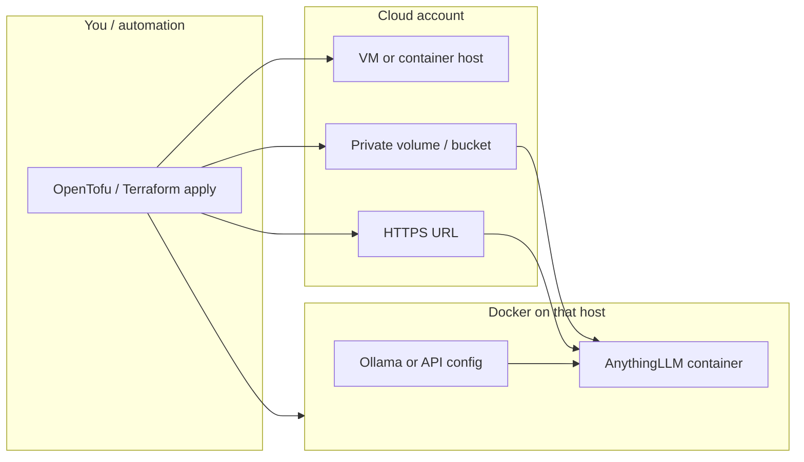
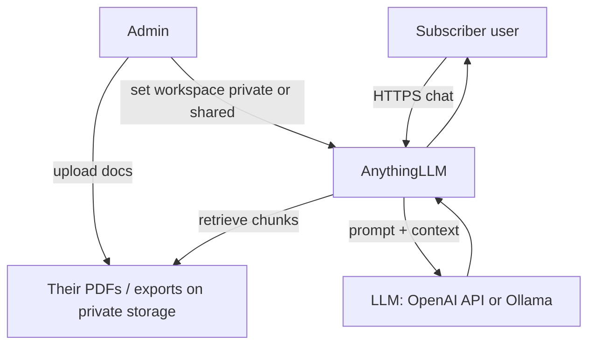
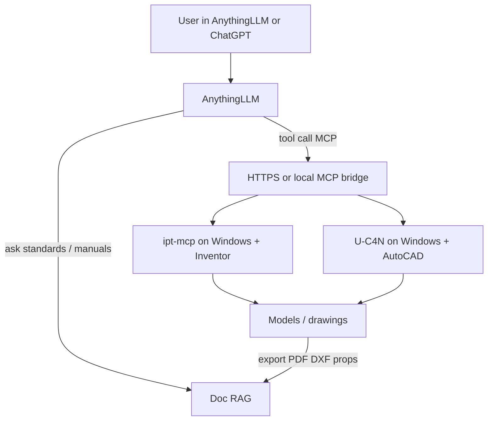

# Plan — Autodesk MCP + cloneable RAG cloud

## Docker vs Terraform (roles)

| | **Docker** | **Terraform** (or OpenTofu) |
|--|------------|-----------------------------|
| Job | Runs the apps in **containers** | **Creates** the cloud stuff those containers live on |
| Handles | Start/stop, restart on crash, **healthchecks**, networks between containers, volumes for data | VMs/K8s/storage/DNS/firewalls, “what goes where”, one module per subscriber |
| Does *not* | Provision whole cloud accounts / isolate tenants by itself | Stay running as the AI — it only apply/create/update infra |
| AI brain | **AnythingLLM** runs *inside* a container | Terraform points that container at private storage + LLM endpoint, **separate per subscriber** |

**Short version:** Terraform spins up and links the boxes. Docker keeps the services running (and restarts unhealthy ones). AnythingLLM is the AI brain in a container; each subscriber’s data stays on their own volume/workspace.

**License / cost**

| Tool | Free to use? |
|------|----------------|
| **Docker Engine** (Linux server) | Yes (open source). Docker *Desktop* on work PCs has its own company license rules. |
| **Terraform** CLI | Yes — open source (BSL for HashiCorp Terraform; community often uses **OpenTofu**, a free open fork, same workflow). |
| **Terraform Cloud** (HashiCorp SaaS) | Free tier exists; paid for teams — optional, not required. |

You can do this stack with **OpenTofu + Docker** at $0 software license cost (you still pay cloud compute).

---

## Simple scope (v1)

### In scope
1. **AnythingLLM** — cloneable private / public AI (docs + chat)
2. **OpenTofu/Terraform module** — spin up one isolated subscriber stack
3. **Docker Compose** on that stack — AnythingLLM (+ DB/vector as needed)
4. **Doc ingest** — PDFs and text first; CAD exports later
5. **LLM plug** — cloud API and/or Ollama on the same (or sibling) host
6. **Wire docs only** — private workspace vs shared/public workspace

### Later (v2)
7. Windows **CAD workers** with **ipt-mcp** + **U-C4N** Autocad-MCP  
8. Pipeline: `.ipt` / `.dwg` → PDF/DXF/properties → into that subscriber’s RAG  
9. ChatGPT remote MCP connector / HTTPS gateway  
10. Billing / signup automation  

### Out of scope for v1
- Merging Inventor + AutoCAD into one MCP binary  
- Raw binary `.ipt`/`.dwg` as RAG documents without export  
- Multi-region HA / full Kubernetes (unless you already standardize on it)

---

## Operation flow

### A. Provision (clone a subscriber AI)

### B. Day-to-day use (private or public AI)

### C. Later: CAD in the loop (v2)

---

## What “separate” means per subscriber

| Layer | Isolation |
|-------|-----------|
| Infra | Own VM **or** own Compose project + volumes (Terraform module input: `subscriber_id`) |
| Data | Own disk/bucket — other tenants cannot read it |
| AI brain | Own AnythingLLM workspace(s); private by default |
| Public AI | Optional second workspace marked shared, or embed widget |
| CAD (v2) | Optional dedicated Windows worker or pooled workers with strict tenant auth |

---

## Build order (start creating)

| Step | Deliverable |
|------|-------------|
| 1 | Docker Compose: AnythingLLM up locally, chat + PDF upload works |
| 2 | OpenTofu/Terraform module: one VM + Compose + volume + HTTPS |
| 3 | Parameterize module: `subscriber_id`, private vs public workspace flags |
| 4 | Document “clone” = `tofu apply -var=subscriber_id=acme` |
| 5 | (v2) Windows CAD worker image + MCP + export-to-RAG path |

---

## Stack choices (locked for v1)

| Role | Choice | License |
|------|--------|---------|
| RAG / cloneable AI | AnythingLLM | MIT |
| Containers | Docker + Compose | OSS |
| Infra as code | OpenTofu (Terraform-compatible) | MPL-2.0 |
| Inventor MCP (v2) | ipt-mcp | Apache-2.0 |
| AutoCAD MCP (v2) | U-C4N Autocad-MCP | MIT |
