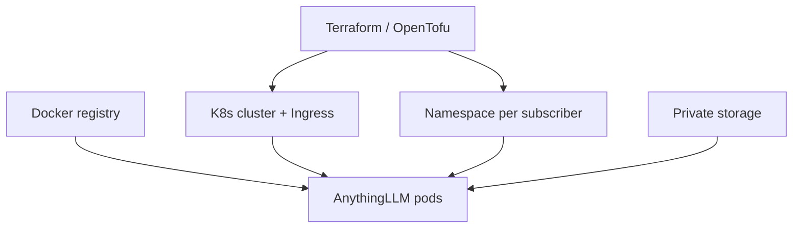
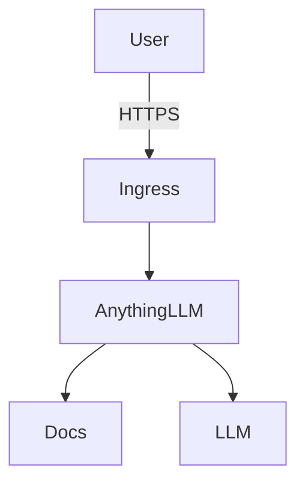
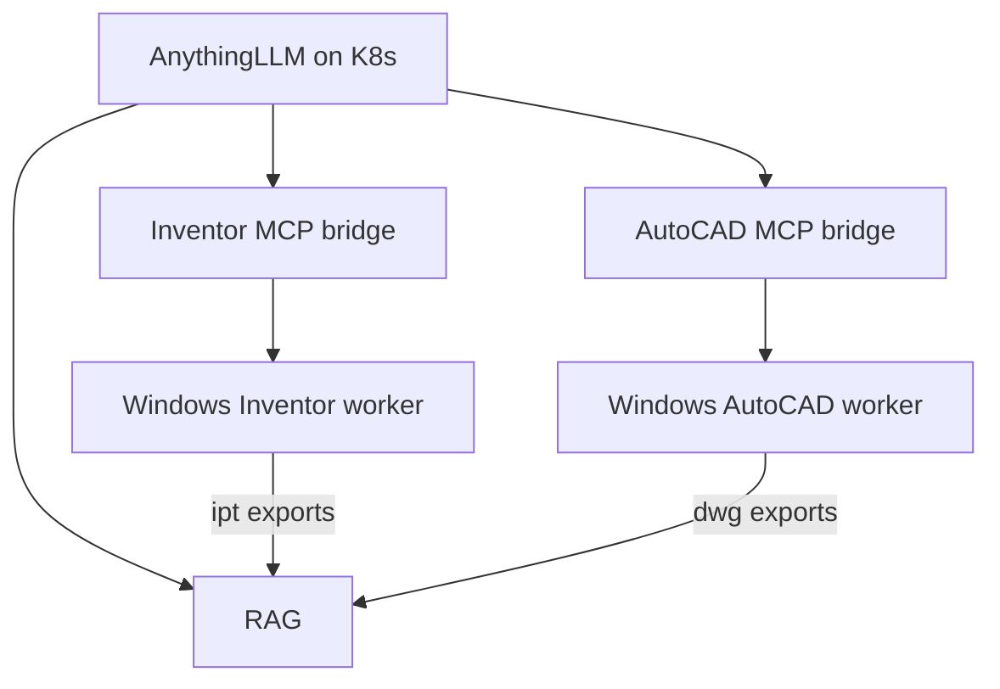

# Plan — Autodesk MCP + RAG cloud

## Stack

| Layer | Tool | Does |
|-------|------|------|
| Images | **Docker** | Build / ship OCI images |
| Orchestration | **Kubernetes** | Pods, health, restarts, scale |
| Infra | **OpenTofu / Terraform** | Cluster, storage, DNS, tenant clone |
| AI / RAG | **AnythingLLM** | Private / public subscriber AI |
| Inventor (v2) | **ipt-mcp** | Drive Inventor only |
| AutoCAD (v2) | **U-C4N** | Drive AutoCAD only |

**Inventor and AutoCAD stay separate products** — separate MCP servers, folders, Windows workers, export pipelines, and (later) SKUs. Shared pieces are RAG/AI, Terraform/K8s, and the ChatGPT gateway pattern — not a combined “Autodesk CAD” blob.

```text
Terraform/OpenTofu → Kubernetes → Pods (AnythingLLM)
                         ↑
                  Docker images (registry)
```

Local laptop only: Docker Compose OK.  
Cloud: **K8s** (not Compose).

---

## Scope — v1

**In**
- AnythingLLM (private / public workspaces)
- Terraform/OpenTofu → K8s cluster + storage + Ingress
- Docker images (official AnythingLLM + any custom)
- K8s deploy per subscriber (Namespace / Helm)
- PDF + text ingest
- LLM: cloud API and/or Ollama
- Clone path: `subscriber_id`

**Out**
- CAD MCP in v1
- Raw `.ipt` / `.dwg` as RAG (no export)
- Multi-region active-active
- Billing / signup automation

---

## Scope — v2 (Inventor ≠ AutoCAD)

Build and ship as **two tracks**, not one merged CAD MCP:

| Track | MCP | Host | Export → RAG |
|-------|-----|------|--------------|
| **Inventor** | `ipt-mcp` → `cad/inventor/` | Windows + Inventor license | `.ipt` → PDF / props / etc. |
| **AutoCAD** | `U-C4N` → `cad/autocad/` | Windows + AutoCAD license | `.dwg` → PDF / DXF / props / etc. |

Also in v2 (shared platform, not merged CAD):
- ChatGPT remote HTTPS MCP gateway (can front either track)
- Billing / signup (per track or bundled SKU — decide later; code stays separate)
- Optional in-app plugin per host app (Inventor add-in vs AutoCAD add-in)

---

## Flows

### Provision (clone)



### Use



### CAD later (v2) — separate tracks



---

## Tenant isolation

| What | How |
|------|-----|
| Compute | K8s Namespace (+ NetworkPolicy) |
| Data | Own PVC / bucket |
| AI | Own AnythingLLM; private by default |
| Public AI | Shared workspace or public route |
| Inventor (v2) | Own Windows worker / pool; tenant auth |
| AutoCAD (v2) | Own Windows worker / pool; tenant auth |

---

## Build order

Honest status lives in [`docs/REMAINING.md`](docs/REMAINING.md). Scaffold ≠ done.

| # | Do | Status |
|---|----|--------|
| 1 | Modular folders + working `test-ui` (Ollama, mock CAD) | **Working** |
| 2 | Local AnythingLLM (swap for `rag/local`) | Not done |
| 3 | Docker engine usable | **Blocked** |
| 4 | Terraform → K8s cluster | Not done (skeleton only) |
| 5 | K8s manifests deployed + probes + PVC + Ingress | Manifests only; not deployed |
| 6 | Clone via `subscriber_id` | Not done |
| 7 | v2 Inventor track: `cad/inventor` + ipt-mcp + export→RAG | **MCP live** (add-in must load in Inventor) |
| 8 | v2 AutoCAD track: `cad/autocad` + U-C4N + export→RAG | **MCP live** (ezdxf verified; COM when acad open) |

Do **not** collapse 7+8 into one “CAD” milestone.

## Repo modules

| Folder | Replaceable piece |
|--------|-------------------|
| `rag/` | Knowledge backend (shared) |
| `docker/` | Images / local Compose |
| `k8s/` | Orchestration manifests |
| `terraform/` | Infra modules |
| `cad/inventor/` | Inventor MCP only (ipt-mcp) |
| `cad/autocad/` | AutoCAD MCP only (U-C4N) |
| `test-ui/` | Dev chat harness (mocks both separately) |

---

## Licenses (OSS)

| Piece | License |
|-------|---------|
| AnythingLLM | MIT |
| Kubernetes | Apache-2.0 |
| OpenTofu | MPL-2.0 |
| ipt-mcp | Apache-2.0 |
| U-C4N Autocad-MCP | MIT |
