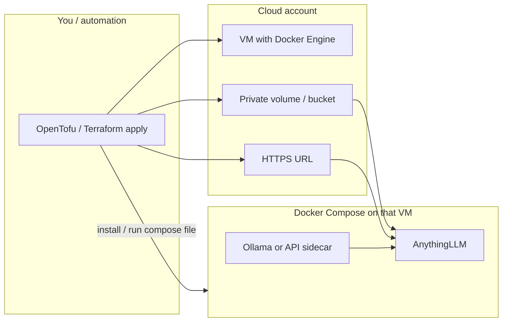
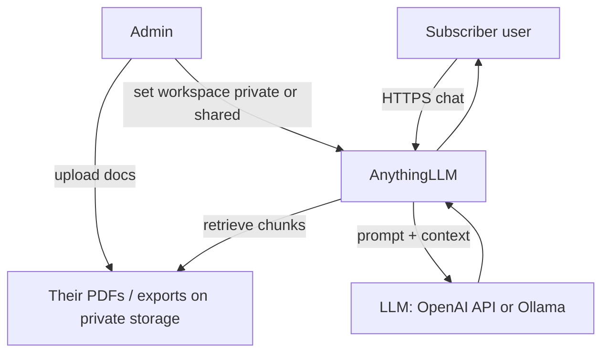
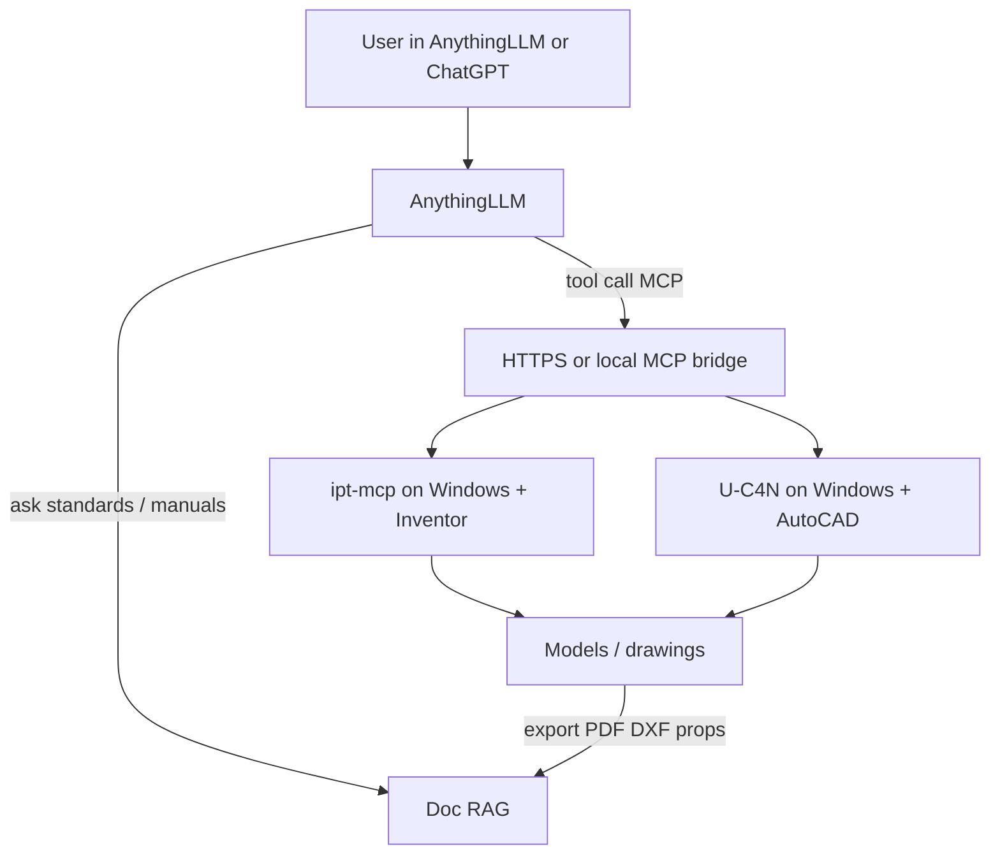

# Plan — Autodesk MCP + cloneable RAG cloud

## Docker + Compose + Terraform (all three)

Yes — v1 uses **all three**. They stack; they don’t replace each other.

| | **Docker** (Engine) | **Docker Compose** | **Terraform / OpenTofu** |
|--|---------------------|--------------------|---------------------------|
| Job | The **runtime** that runs container images | The **app recipe** for one stack: which containers, how they link | The **cloud recipe** that creates the machine/network/storage and deploys that Compose stack per subscriber |
| Handles | Pull images, create/run containers, cgroups/networking at engine level | `docker-compose.yml`: services, **networks**, **volumes**, **depends_on**, **healthchecks**, restart policies, env files | VMs (or similar), disks/buckets, DNS/TLS, firewalls, “what goes where”, `subscriber_id` clones |
| Health / failure | Engine can restart a container if asked | **Where we define** healthchecks + restart + “wait for DB before AnythingLLM” | Can replace a whole dead VM / re-apply infra; not the day-to-day process supervisor |
| AI brain | Runs the AnythingLLM **image** | Wires AnythingLLM (+ DB/vector/Ollama if local) as one unit | Places that Compose unit on isolated infra + private storage per subscriber |
| Do we need it? | **Yes** — nothing runs without the engine | **Yes** (v1) — simplest way to run/link the AI stack with healthchecks | **Yes** (cloud) — how we clone and isolate subscribers |

**Short version:**
1. **Terraform/OpenTofu** — builds the box and storage (clone per subscriber).  
2. **Docker Compose** — on that box, defines AnythingLLM (+ friends), networks, volumes, **healthchecks**, restarts.  
3. **Docker Engine** — actually runs those containers.

Local laptop testing can be Compose + Docker only (no Terraform). Cloud “clone a subscriber” adds Terraform/OpenTofu on top.

**License / cost**

| Tool | Free to use? |
|------|----------------|
| **Docker Engine** (Linux server) | Yes (open source). Docker *Desktop* on work PCs has its own company license rules. |
| **Docker Compose** | Yes — free/OSS (Compose V2 plugin with Engine). |
| **Terraform** CLI | Usable free; HashiCorp BSL. Many teams use **OpenTofu** (MPL-2.0 fork, same workflow). |
| **Terraform Cloud** | Optional SaaS; free tier / paid teams — not required. |

Software licenses for this trio can be $0; you still pay cloud compute.

---

## Simple scope (v1)

### In scope
1. **AnythingLLM** — cloneable private / public AI (docs + chat)
2. **OpenTofu/Terraform module** — spin up one isolated subscriber stack
3. **Docker Compose** on that stack — AnythingLLM (+ DB/vector as needed)
4. **Doc ingest** — PDFs and text first; CAD exports later
5. **LLM plug** — cloud API and/or Ollama on the same (or sibling) host
6. **Wire docs only** — private workspace vs shared/public workspace

### Later (v2)
7. Windows **CAD workers** with **ipt-mcp** + **U-C4N** Autocad-MCP  
8. Pipeline: `.ipt` / `.dwg` → PDF/DXF/properties → into that subscriber’s RAG  
9. ChatGPT remote MCP connector / HTTPS gateway  
10. Billing / signup automation  

### Out of scope for v1
- Merging Inventor + AutoCAD into one MCP binary  
- Raw binary `.ipt`/`.dwg` as RAG documents without export  
- Multi-region HA / full Kubernetes (unless you already standardize on it)

---

## Operation flow

### A. Provision (clone a subscriber AI)

### B. Day-to-day use (private or public AI)

### C. Later: CAD in the loop (v2)

---

## What “separate” means per subscriber

| Layer | Isolation |
|-------|-----------|
| Infra | Own VM **or** own Compose project + volumes (Terraform module input: `subscriber_id`) |
| Data | Own disk/bucket — other tenants cannot read it |
| AI brain | Own AnythingLLM workspace(s); private by default |
| Public AI | Optional second workspace marked shared, or embed widget |
| CAD (v2) | Optional dedicated Windows worker or pooled workers with strict tenant auth |

---

## Build order (start creating)

| Step | Deliverable |
|------|-------------|
| 1 | Docker Compose: AnythingLLM up locally, chat + PDF upload works |
| 2 | OpenTofu/Terraform module: one VM + Compose + volume + HTTPS |
| 3 | Parameterize module: `subscriber_id`, private vs public workspace flags |
| 4 | Document “clone” = `tofu apply -var=subscriber_id=acme` |
| 5 | (v2) Windows CAD worker image + MCP + export-to-RAG path |

---

## Stack choices (locked for v1)

| Role | Choice | License |
|------|--------|---------|
| RAG / cloneable AI | AnythingLLM | MIT |
| Container runtime | Docker Engine | OSS |
| App stack / healthchecks | Docker Compose | OSS |
| Infra as code | OpenTofu (Terraform-compatible) | MPL-2.0 |
| Inventor MCP (v2) | ipt-mcp | Apache-2.0 |
| AutoCAD MCP (v2) | U-C4N Autocad-MCP | MIT |
