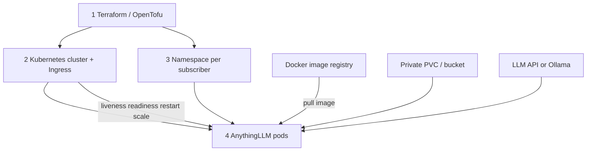
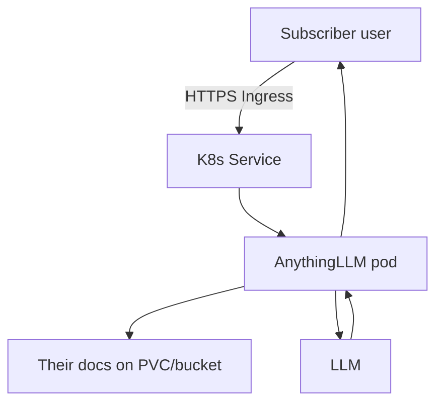
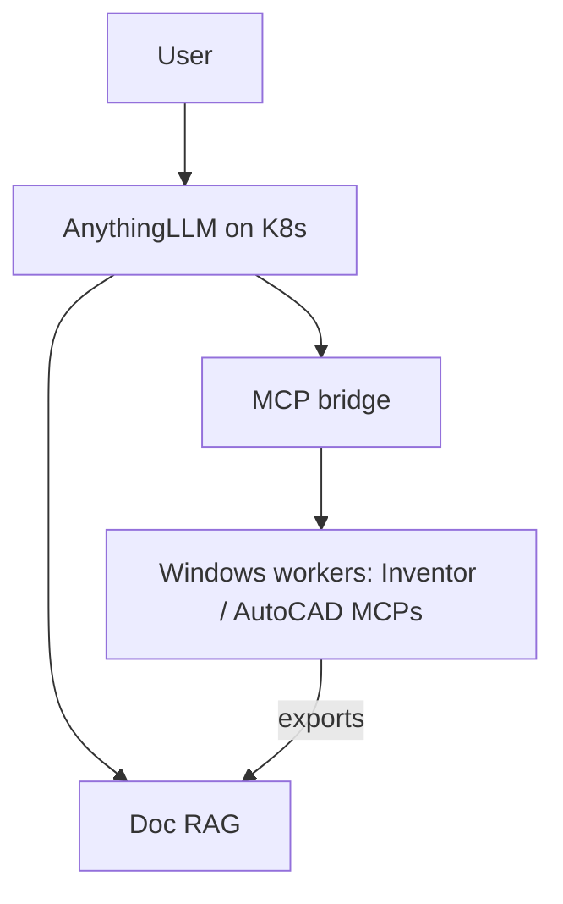

# Plan — Autodesk MCP + cloneable RAG cloud

## Docker + Kubernetes + Terraform (the real trio)

Sorry for the mix-up earlier — when you meant cluster health/scaling/pods, that’s **Kubernetes (K8s)**, not Docker Compose.

| | **Docker** | **Kubernetes (K8s)** | **Terraform / OpenTofu** |
|--|------------|----------------------|---------------------------|
| Job | Build and ship **container images** (OCI). Local run for dev. | **Orchestrate** those containers across a cluster: pods, deploy, scale, heal | **Provision** the cloud: cluster, node pools, disks, DNS, network, tenant isolation |
| Handles | `docker build` / image registry; optional local `docker run` | Pods, Deployments/StatefulSets, Services, Ingress, **liveness/readiness probes**, restarts, rolling updates, multi-node | VPC, managed K8s (EKS/AKS/GKE or on-prem), storage classes, TLS, `subscriber_id` namespaces or clusters |
| Health / failure | Single-host only | **Cluster-level**: unhealthy pod replaced, reschedule if node dies, scale out | Recreate/fix infra by re-applying; not the day-to-day pod supervisor |
| AI brain | AnythingLLM **image** | AnythingLLM runs as **pods** (per subscriber namespace or dedicated release) | Creates the cluster + storage so each subscriber stays separate |
| Do we need it? | **Yes** — we still package apps as images | **Yes** (cloud product) — this is where connections, health, scaling live | **Yes** — spins up / links cloud resources |

**Docker Compose** = optional **local laptop** shortcut only. Production cloud path is **K8s**, not Compose.

**Short version:**
1. **Terraform / OpenTofu** — creates the Kubernetes cluster, storage, DNS.  
2. **Kubernetes** — runs AnythingLLM in pods; health probes, restarts, scaling.  
3. **Docker** — builds the images K8s pulls and runs (nodes often use containerd under the hood; images stay Docker/OCI format).

```text
Terraform/OpenTofu  →  Kubernetes cluster  →  Pods (AnythingLLM, etc.)
                              ↑
                     Docker-built images from registry
```

### Is Kubernetes still “cutting edge”?

**It’s the industry standard, not a fad.** In 2026 it’s mature and mainstream — what serious cloud platforms use for containerized apps. “Cutting edge” today is more WASM/edge/serverless experiments; **K8s is the proven backbone**. Knowing it is an advantage. We should use it for this cloud service.

**License / cost**

| Tool | Free to use? |
|------|----------------|
| **Docker** (Engine / image tooling) | Engine OSS yes; Desktop has company rules |
| **Kubernetes** | Yes — open source (Apache-2.0) |
| **Managed K8s** (EKS/AKS/GKE) | Control plane / nodes are paid cloud usage |
| **Terraform / OpenTofu** | CLI free; OpenTofu MPL-2.0; Cloud SaaS optional |

---

## Simple scope (v1)

### In scope
1. **AnythingLLM** — cloneable private / public AI (docs + chat)
2. **OpenTofu/Terraform** — provision K8s cluster + storage + Ingress/DNS
3. **Docker** — image build/publish for anything custom; pull official AnythingLLM image
4. **Kubernetes** — deploy AnythingLLM (Deployment/StatefulSet), probes, per-subscriber **Namespace** (or Helm release)
5. **Doc ingest** — PDFs and text first; CAD exports later
6. **LLM plug** — cloud API and/or in-cluster / sidecar Ollama where it fits
7. Private vs public workspaces

### Later (v2)
8. Windows **CAD workers** (often **outside** Linux K8s): **ipt-mcp** + **U-C4N**  
9. `.ipt` / `.dwg` → PDF/DXF/properties → subscriber RAG  
10. ChatGPT remote MCP / HTTPS gateway  
11. Billing / signup automation  

### Out of scope for v1
- Merging Inventor + AutoCAD into one MCP binary  
- Raw binary `.ipt`/`.dwg` as RAG without export  
- Multi-region active-active (can add once single-cluster path works)

---

## Operation flow

### A. Provision (clone a subscriber AI)



### B. Day-to-day use



### C. Later: CAD (v2)



CAD apps stay on **Windows nodes/VMs**; Linux K8s hosts the RAG/AI front door.

---

## What “separate” means per subscriber

| Layer | Isolation |
|-------|-----------|
| K8s | Namespace + NetworkPolicy (+ optional dedicated release) |
| Data | Own PVC / bucket — other tenants blocked |
| AI | Own AnythingLLM instance or workspace; private by default |
| Public AI | Shared workspace or public Ingress path / embed |
| CAD (v2) | Windows pool with tenant auth — not mixed into Linux pods |

---

## Build order

| Step | Deliverable |
|------|-------------|
| 1 | Local: Docker + AnythingLLM (Compose OK for laptop only) |
| 2 | Terraform/OpenTofu: managed or self-hosted **Kubernetes** cluster |
| 3 | K8s manifests or Helm: AnythingLLM + probes + PVC + Ingress |
| 4 | Clone path: new Namespace / values for `subscriber_id` |
| 5 | Private vs public workspace runbook |
| 6 | (v2) Windows CAD workers + MCP + export-to-RAG |

---

## Stack choices

| Role | Choice | License |
|------|--------|---------|
| RAG / cloneable AI | AnythingLLM | MIT |
| Images | Docker / OCI | OSS |
| Orchestration (cloud) | **Kubernetes** | Apache-2.0 |
| Local-only helper | Docker Compose | OSS |
| Infra as code | OpenTofu (Terraform-compatible) | MPL-2.0 |
| Inventor MCP (v2) | ipt-mcp | Apache-2.0 |
| AutoCAD MCP (v2) | U-C4N Autocad-MCP | MIT |
